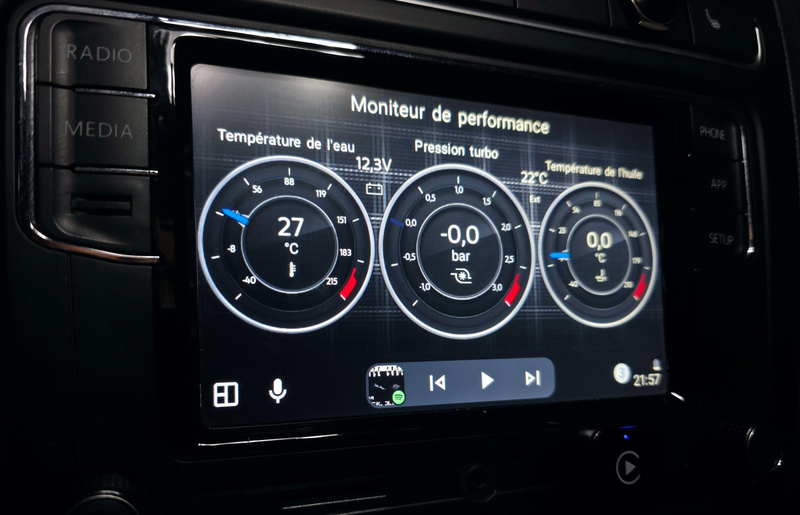
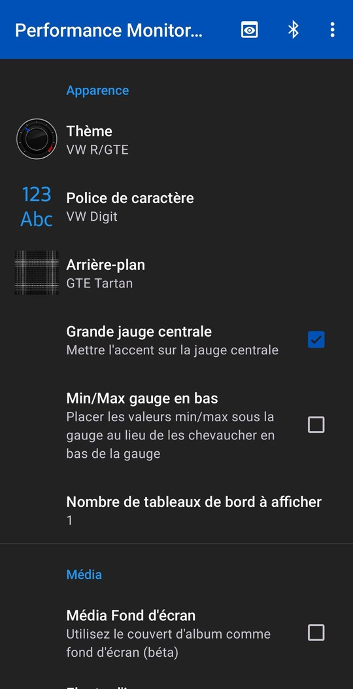
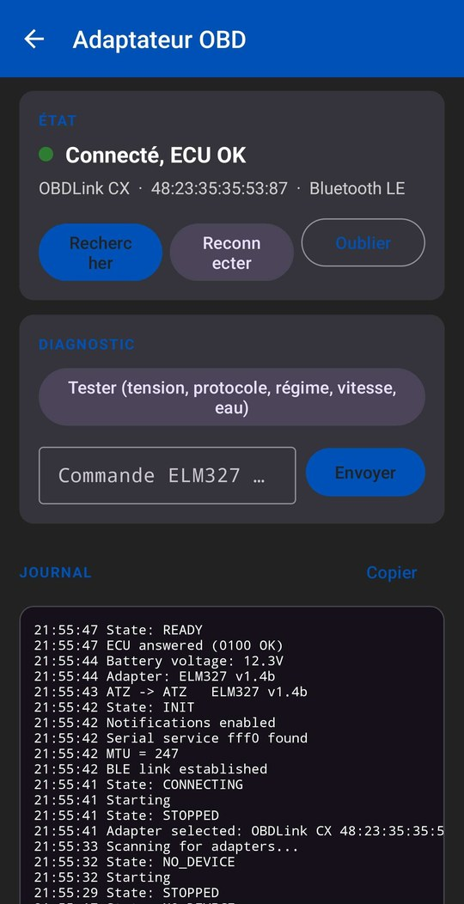

<p align="center">
  
</p>

<h1 align="center">Performance Monitor AAOBD</h1>

<p align="center">
  Jauges moteur en temps réel sur l'écran Android Auto, alimentées directement par un adaptateur OBD-II Bluetooth (OBDLink, vLinker, ELM327...).<br>
  Sans Torque, sans application tierce, sans compte, sans internet.
</p>

<p align="center"><a href="README.md">English version</a></p>

---

## Captures

<p align="center">
  
</p>
<p align="center">
  
  &nbsp;
  
</p>

## Fonctions

- **Tableaux de bord sur l'écran de la voiture** : jusqu'à 3 jauges et 4 valeurs par tableau, autant de tableaux que voulu, balayage pour changer.
- **Graphique en direct** des valeurs affichées (balayage vertical).
- **Alarmes** : changement de couleur au-dessus ou en dessous d'un seuil (shift light, surchauffe).
- **Thèmes, polices et fonds** inspirés des combinés d'origine, pochette d'album en fond.
- **Liaison Bluetooth directe** avec l'adaptateur, Bluetooth LE ou classique : appairage intégré, reconnexion automatique, requêtes CAN groupées, replis automatiques pour les clones ELM327.
- **Valeurs calculées** : pression turbo (MAP - Baro), tension batterie lue par l'adaptateur.
- **Formules de conversion** par valeur (expressions EvalEx).
- **Écran de diagnostic** : état, journal, test rapide, console ELM327.
- **Import / export** des tableaux de bord.

## Matériel

- Téléphone : Android 9 ou plus avec Android Auto.
- Véhicule : compatible OBD-II / EOBD (Europe : essence 2001+, diesel 2004+).
- Un adaptateur Bluetooth compatible ELM327 :

| Adaptateur | Liaison | Statut |
|---|---|---|
| OBDLink CX | Bluetooth LE | Testé |
| OBDLink MX+, MX, LX | Bluetooth | Pris en charge, retours bienvenus |
| Vgate vLinker MC+, FS, BM+ | Bluetooth | Pris en charge, retours bienvenus |
| Vgate vLinker MC / iCar Pro BLE | Bluetooth LE | Pris en charge, retours bienvenus |
| Vgate iCar Pro, iCar 2 (versions Bluetooth) | Bluetooth | Pris en charge, retours bienvenus |
| Veepeak OBDCheck BLE / BLE+ | Bluetooth LE | Pris en charge, retours bienvenus |
| Konnwei KW902, KW903 | Bluetooth | Pris en charge, retours bienvenus |
| Clones ELM327 v1.5 / v2.1 génériques | Bluetooth ou BLE | Au mieux |

Adaptateurs Wi-Fi non pris en charge : ils monopolisent le Wi-Fi du téléphone, nécessaire à Android Auto sans fil.

## Installation

L'app n'est pas sur Google Play. Android Auto n'affiche que les apps installées depuis un store : installer avec **[AAEnabler](https://github.com/malebuffy/AAEnabler)**, qui installe l'APK comme Android Auto l'attend.

1. Installer AAEnabler depuis sa [page de releases](https://github.com/malebuffy/AAEnabler/releases/latest).
2. Télécharger le dernier `PerformanceMonitorAAOBD-x.y.z-release.apk` dans [Releases](https://github.com/Le-F-Sur-GitH/Performance-Monitor-AAOBD/releases/latest).
3. Ouvrir AAEnabler > **Select local APK** > choisir l'APK téléchargé > **Install app**.
4. Ouvrir Performance Monitor AAOBD sur le téléphone, accepter les autorisations Bluetooth.
5. Brancher l'adaptateur, mettre le contact, puis **icône Bluetooth** > **Rechercher** et choisir l'adaptateur.
   OBDLink CX : appairage accepté uniquement dans les 5 minutes après le branchement.
   Adaptateurs Bluetooth classiques : valider la demande d'appairage, code PIN généralement `1234` ou `0000`.
6. Connecter le téléphone à la voiture (ou relancer Android Auto) : **Performance Monitor AAOBD** apparaît dans le lanceur Android Auto.

Installer chaque mise à jour de la même façon, via AAEnabler.
Les jauges se configurent sur le téléphone, dans les paramètres de l'app.

<details>
<summary>Sans AAEnabler</summary>

Installer l'APK normalement, puis dans les paramètres Android Auto : toucher **Version** 10 fois > menu > **Paramètres pour les développeurs** > activer **Sources inconnues**.
Selon la version d'Android Auto, l'app peut rester masquée : utiliser AAEnabler dans ce cas.
</details>

> Depuis la 1.x : l'identifiant de l'app a changé, la 2.0 s'installe comme une nouvelle app.
> Exporter les tableaux de bord depuis la 1.x (menu > Exporter), la désinstaller, puis importer dans la 2.0.

## Compilation

```bash
git clone https://github.com/Le-F-Sur-GitH/Performance-Monitor-AAOBD.git
cd Performance-Monitor-AAOBD
./gradlew testDebugUnitTest assembleDebug
```

JDK 17. Les builds debug simulent des valeurs sans adaptateur, pour tester sur le [Desktop Head Unit](tools/dhu/README.md).

## Contribuer

Voir [CONTRIBUTING.md](CONTRIBUTING.md). Pour un problème de connexion, joindre le journal de l'écran Adaptateur OBD (bouton Copier).

## Avertissement

Ne pas manipuler l'app en conduisant. Projet indépendant de Google, OBD Solutions et des constructeurs.

## Crédits et licence

Développé par **Le F**. Licence [GNU GPL v3](LICENSE.md).
Dérivé de [aa-torque](https://github.com/agronick/aa-torque) de Kyle Agronick. Jauges : [SpeedView](https://github.com/anastr/SpeedView) (Apache 2.0). Voir [NOTICE.md](NOTICE.md).
