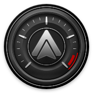

<p align="center">
  
</p>

<h1 align="center">Performance Monitor AAOBD</h1>

<p align="center">
  Real-time engine gauges on your Android Auto screen, fed directly by a Bluetooth OBD-II adapter (OBDLink, vLinker, ELM327...).<br>
  No Torque, no third-party app, no account, no internet.
</p>

<p align="center">
  <a href="https://github.com/Le-F-Sur-GitH/Performance-Monitor-AAOBD/actions/workflows/ci.yml"></a>
  <a href="https://github.com/Le-F-Sur-GitH/Performance-Monitor-AAOBD/releases/latest"></a>
  
  <a href="LICENSE.md"></a>
</p>

<p align="center"><a href="README.fr.md">Version française</a></p>

---

## Features

- **Dashboards on the car screen**: up to 3 gauges and 4 values per dashboard, as many dashboards as you want, swipe to switch.
- **Live chart** of the selected values (swipe up or down).
- **Alarms**: change colours above or below a threshold (shift light, overheating warning).
- **Themes, fonts and backgrounds** inspired by factory clusters, album art background.
- **Direct Bluetooth link** to the adapter, Bluetooth LE or classic: built-in pairing, automatic reconnection, grouped CAN requests for fast refresh, automatic fallbacks for ELM327 clones.
- **Virtual values**: boost pressure (MAP - Baro) and battery voltage read by the adapter.
- **Unit conversion formulas** per value (EvalEx expressions).
- **Diagnostics screen** with state, log, quick test and raw ELM327 console.
- **Import / export** of dashboards.

## Requirements

- Phone: Android 9 or later with Android Auto.
- Vehicle: OBD-II / EOBD compliant (EU: petrol 2001+, diesel 2004+; US: 1996+).
- A Bluetooth ELM327-compatible adapter:

| Adapter | Link | Status |
|---|---|---|
| OBDLink CX | Bluetooth LE | Tested |
| OBDLink MX+, MX, LX | Bluetooth | Supported, reports welcome |
| Vgate vLinker MC+, FS, BM+ | Bluetooth | Supported, reports welcome |
| Vgate vLinker MC / iCar Pro BLE | Bluetooth LE | Supported, reports welcome |
| Vgate iCar Pro, iCar 2 (Bluetooth versions) | Bluetooth | Supported, reports welcome |
| Veepeak OBDCheck BLE / BLE+ | Bluetooth LE | Supported, reports welcome |
| Konnwei KW902, KW903 | Bluetooth | Supported, reports welcome |
| Generic ELM327 v1.5 / v2.1 clones | Bluetooth or BLE | Best effort |

Wi-Fi adapters are not supported: they take over the phone Wi-Fi, which wireless Android Auto needs.
Cheap clones vary a lot; the app falls back to single PID requests when grouped requests are not supported.
Tried an adapter? Tell us in an issue so this table can be updated.

## Installation

The app is not on Google Play. Android Auto only shows apps installed from a store, so install it with **[AAEnabler](https://github.com/malebuffy/AAEnabler)**, which installs the APK the way Android Auto expects.

1. Install AAEnabler from its [releases page](https://github.com/malebuffy/AAEnabler/releases/latest).
2. Download the latest `PerformanceMonitorAAOBD-x.y.z-release.apk` from [Releases](https://github.com/Le-F-Sur-GitH/Performance-Monitor-AAOBD/releases/latest).
3. Open AAEnabler > **Select local APK** > pick the downloaded APK > **Install app**.
4. Open Performance Monitor AAOBD on the phone and allow the Bluetooth permissions.
5. Plug the adapter in, switch the ignition on, then tap the **Bluetooth icon** > **Search** and pick the adapter.
   OBDLink CX: pairing is only accepted during the first 5 minutes after it is plugged in.
   Bluetooth (classic) adapters: confirm the pairing request, PIN usually `1234` or `0000`.
6. Connect the phone to the car (or restart Android Auto): **Performance Monitor AAOBD** appears in the Android Auto launcher.

Install every update the same way, through AAEnabler.
Gauges and values are configured on the phone, in the app settings.

<details>
<summary>Without AAEnabler</summary>

Install the APK normally, then in Android Auto settings tap **Version** 10 times > menu > **Developer settings** > enable **Unknown sources**.
Depending on the Android Auto version, the app may still stay hidden: use AAEnabler in that case.
</details>

> Upgrading from 1.x: the application ID changed, so 2.0 installs as a new app.
> Export your dashboards from 1.x (menu > Export dashboards), uninstall it, then import them in 2.0.

## Building

```bash
git clone https://github.com/Le-F-Sur-GitH/Performance-Monitor-AAOBD.git
cd Performance-Monitor-AAOBD
./gradlew testDebugUnitTest assembleDebug
```

Requires JDK 17. Debug builds simulate sensor values when no adapter is connected, so the dashboard can be tested on the [Desktop Head Unit](tools/dhu/README.md).

## Project layout

| Path | Role |
|---|---|
| `app/src/main/java/.../stats/ElmAdapter.kt` | Adapter discovery, ELM327 initialisation, polling loop |
| `app/src/main/java/.../stats/transport/` | Bluetooth LE and Bluetooth classic (SPP) links |
| `app/src/main/java/.../stats/ObdParser.kt` | Decoding of OBD answers (unit tested) |
| `app/src/main/java/.../stats/ObdPids.kt` | PID table, formulas, refresh rates |
| `app/src/main/java/.../stats/DashboardFragment.kt` | Android Auto dashboard |
| `app/src/main/java/.../prefs/ObdAdapterActivity.kt` | Pairing and diagnostics screen |
| `app/src/main/java/.../prefs/` | Phone settings |
| `lib/speedviewlib` | Gauge library (SpeedView, Apache 2.0) |
| `tools/dhu` | Desktop Head Unit helpers |

## Contributing

Bug reports and pull requests are welcome. Read [CONTRIBUTING.md](CONTRIBUTING.md) first.
When reporting a connection problem, attach the log from the OBD adapter screen (Copy button).

## Privacy

The app does not send anything over the network. Vehicle data stays on the phone. See [PRIVACY_POLICY.md](PRIVACY_POLICY.md).

## Disclaimer

Do not interact with the app while driving. This project is not affiliated with Google, OBD Solutions or any car manufacturer. Brand names used for themes belong to their owners.

## Credits and license

Developed by **Le F**. Released under the [GNU GPL v3](LICENSE.md).

Derived from [aa-torque](https://github.com/agronick/aa-torque) by Kyle Agronick, itself based on the Android Auto SDK work of Martoreto and Chillout.
Gauges: [SpeedView](https://github.com/anastr/SpeedView) by anastr (Apache 2.0). See [NOTICE.md](NOTICE.md).
